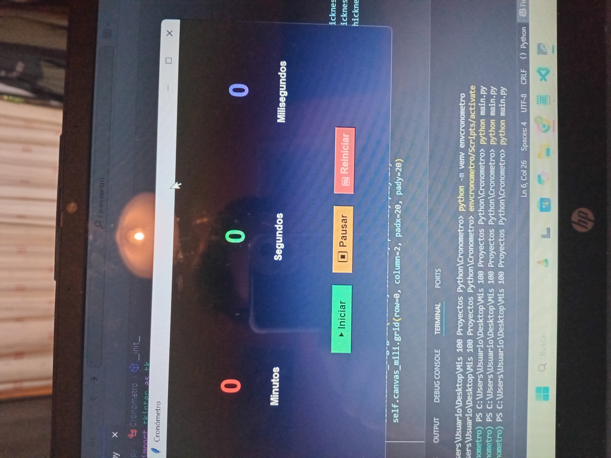
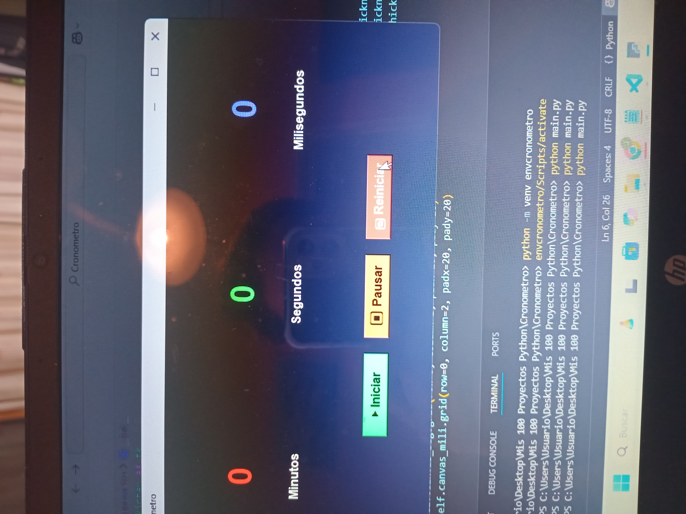
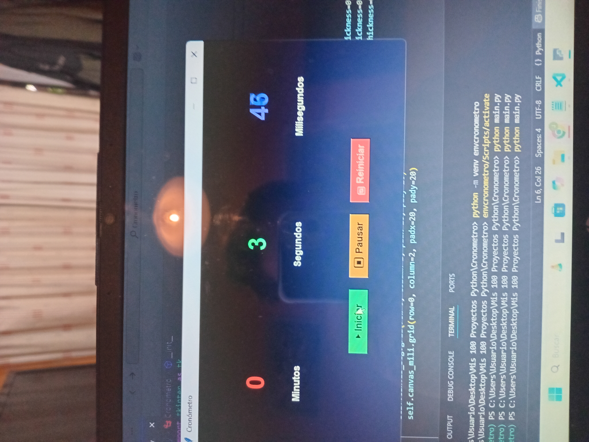

# ⏱ Python Stopwatch (Tkinter GUI)

A simple and modern **stopwatch** built with **Python** and **Tkinter**.  
It allows you to start, pause, reset and track **minutes, seconds, and milliseconds** with a clean graphical interface.

---

## 🖼️ Screenshots

Here are some previews of the application:

  
  
  
  

---

## 📝 Features
- Start, pause, and reset the stopwatch.
- Tracks **minutes, seconds, and milliseconds**.
- User-friendly **Tkinter GUI**.
- Clean and responsive design.

---

## 🚀 How to Run
1. Clone this repository:
   ```bash
   git clone https://github.com/your-username/python-chronometer-gui.git
   cd python-chronometer-gui

2. Run the program:
   python main.py
